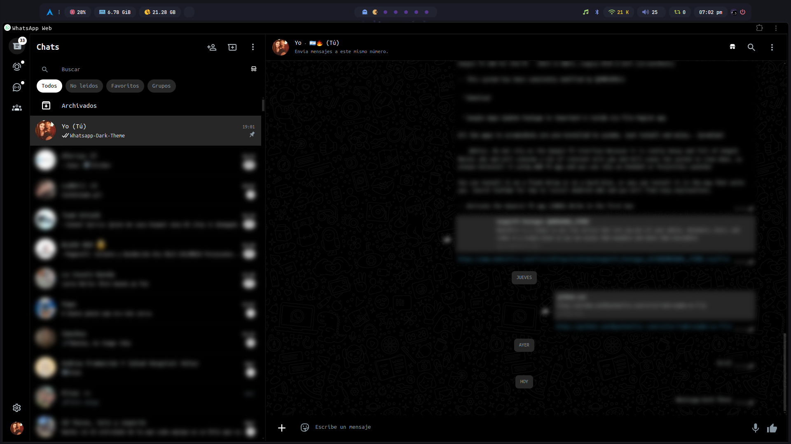

# **WhatsApp Dark Theme**
  
  ## Instalación
### Windows
  1. Descargar y descomprimir el archivo "Whatsapp-Dark-Theme.zip" en la ruta que desee.
  2. Abra su navegador eh ingrese al apartado de administración de extenciones. Ej:chrome://extensions/(Google Chrome).
  3. Active el modo de desarrollador o depuración.
  4. Cargue la extensión sin empaquetar e ingrese al sitio "web.whatsapp.com".
   ### Linux
  1. Clone el repositorio en la direccion que desea, "git clone https://github.com/MauuXL/whatsapp-dark-theme.git".
  2. Ahora puede optar por hacerlo "manual" de la misma forma que en windows o por terminal:\
    - Google Chrome: "google-chrome --load-extension=/ruta/de/la/carpeta/de/la/extensión".\
    * Firefox: "firefox --load-extension=/ruta/de/la/carpeta/de/la/extensión".
